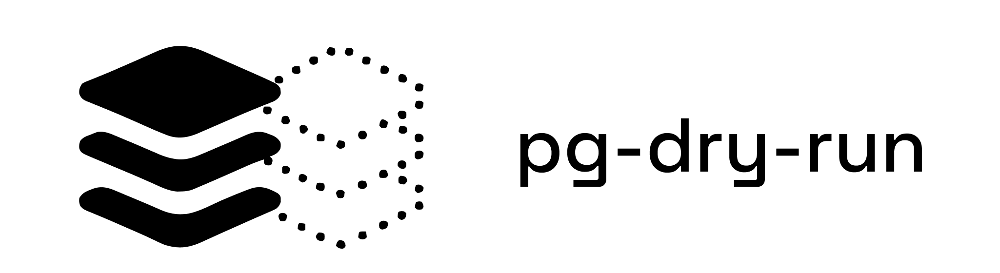

<p align="center">
  
</p>

<p align="center">
  <strong>Preview the effect of agent-generated Postgres writes before they run.</strong>
  <br>
  Turn <code>INSERT</code>, <code>UPDATE</code>, and <code>DELETE</code> into
  row-level proposals you can inspect, approve, and apply safely.
</p>

<p align="center">
  <a href="https://github.com/polycore/pg-dry-run/actions/workflows/ci.yml"></a>
  <a href="https://www.npmjs.com/package/pg-dry-run"></a>
  <a href="LICENSE"></a>
</p>

<p align="center">
  <a href="#why-this-exists">Why</a>
  · <a href="#quick-start">Quick start</a>
  · <a href="#how-it-works">How it works</a>
  · <a href="#how-polycore-uses-pg-dry-run">Polycore</a>
  · <a href="#safety-model">Safety</a>
  · <a href="#api">API</a>
</p>

---

## Why this exists

AI agents are becoming good enough to inspect schemas, generate SQL, and operate
real applications. Giving an agent read access to Postgres is useful and can be
contained with a read-only role. Giving it write access is a different problem.

An agent can generate a perfectly valid statement that does something nobody
intended:

```sql
UPDATE profiles SET status = 'suspended' WHERE email LIKE '%@acme.com';
```

The SQL looks reasonable. The production data decides whether it updates one
account or fourteen, including a service account nobody remembered. An insert
can pick up a dangerous column default that never appears in the statement. A
delete can reach other tables through foreign keys.

Static SQL checks cannot answer those questions because the answers are not in
the query text. Asking a person to approve the SQL has the same limitation: they
see the instruction, not its effect on the current database.

> The useful safety question is not “Does this SQL look reasonable?” It is
> “Which rows will change, how will they change, and what else will be affected?”

`pg-dry-run` adds that missing preview step. It evaluates a write as a read,
returns a plain JSON proposal with the rows and changes, and later applies only
what was previewed. If any existing row changed while the proposal was waiting,
the entire apply is rejected.

<p align="center">
  <code>agent-generated SQL → read-only preview → policy or approval → guarded apply</code>
</p>

The library does not run an AI model and does not prescribe an approval UI. It
takes SQL and bound parameters, then provides the database mechanism an agent,
CLI, admin tool, or approval system can build on.

## Quick start

```sh
npm install pg-dry-run
```

Create a runner and propose a write:

```ts
import { createDryRunner } from "pg-dry-run";

const pg = createDryRunner({ url: process.env.DATABASE_URL });

const proposal = await pg.propose(
  "UPDATE profiles SET status = $1 WHERE email LIKE $2",
  ["suspended", "%@acme.com"],
);

proposal.rowCount; // 14, not the 1 you expected
```

`proposal` is plain JSON. A terminal, agent, or approval screen can render it
like this:

```text
14 rows would change in profiles

  a3f2…  alice@acme.com        status: active -> suspended
  d579…  bob@acme.com          status: active -> suspended
  9c46…  ci-bot@acme.com       status: active -> suspended
  b700…  intern-2024@acme.com  status: active -> suspended
  … 10 more

warning
  BEFORE UPDATE trigger touch_updated_at may change the values actually written
```

Pass the proposal through your own policy or approval flow. `apply()` writes the
previewed rows in one transaction:

```ts
if (await yourApprovalFlow(proposal)) {
  const receipt = await pg.apply(proposal);
  receipt.rowsAffected; // 14
}
```

## What the preview contains

| Statement  | What `pg-dry-run` reports                                                                                                                                                      |
| ---------- | ------------------------------------------------------------------------------------------------------------------------------------------------------------------------------ |
| `UPDATE`   | Every matched row, its primary key, and the before and after values for each assigned column.                                                                                  |
| `DELETE`   | Every matched row, plus reachable foreign keys, cascade counts, and restrictions that would make the delete fail.                                                              |
| `INSERT`   | The complete row the table would create, including values supplied by column defaults. Sequence-generated keys are reported after apply because `nextval()` is itself a write. |
| All writes | The target table, affected columns, warnings, timestamps, and the derived SQL used for the preview.                                                                            |

The default limit is 1,000 rows. Larger writes are refused rather than reduced
to a count that nobody can meaningfully review.

## How it works

### 1. Parse the statement

The library parses one `INSERT`, `UPDATE`, or `DELETE` with PostgreSQL's parser.
It rejects statement shapes it cannot represent faithfully.

For an update or delete, it copies the original predicate as an untouched syntax
tree into an equivalent `SELECT`:

```sql
-- input
UPDATE profiles SET status = $1 WHERE email LIKE $2;

-- derived preview
SELECT
  id,
  xmin::text,
  email::text,
  status AS "status.before",
  ($1::text)::text AS "status.after"
FROM profiles
WHERE email LIKE $2;
```

The caller or model never supplies the derived query. Read
`proposal.derivedSql` to inspect exactly what ran.

### 2. Evaluate the effect without writing

The preview runs inside `BEGIN TRANSACTION READ ONLY`. The library also reads
Postgres catalog metadata for primary keys, column types, generated columns,
triggers, rewrite rules, unique columns, and foreign keys.

Inserts take a slightly different path. Their rows are already explicit, but
the finished row is not: the table may supply defaults for columns the
statement never mentions. `pg-dry-run` resolves those values during the preview
and uses the resolved values during apply.

### 3. Return a portable proposal

A `Proposal` contains the row-level diff, cascade reach, warnings, derived SQL,
and the plan needed to rebuild the write. It has no methods and survives JSON
serialization, so the preview and apply can happen in different processes.

Treat a proposal as a capability, not as an inert report. If it crosses a queue
or network boundary, authenticate it before passing it back to `apply()`.

### 4. Apply only the previewed change

For updates and deletes, each previewed row carries its primary key and `xmin`,
the Postgres transaction ID for that row version. The apply names those exact
keys and versions instead of running the original predicate again.

That gives the apply two useful properties:

- A row that starts matching the predicate after the preview cannot join the
  approved set.
- A previewed row that was modified or deleted causes the whole transaction to
  abort with `StateChangedError`. No partial write lands.

An insert is pinned to the values resolved during preview. For example, a
`created_at DEFAULT now()` keeps the previewed timestamp rather than evaluating
`now()` again after approval.

## How Polycore uses pg-dry-run

`pg-dry-run` is the effect engine behind Polycore's Postgres write path.
[Polycore](https://polycore.ai) gives AI agents and people governed access to
production systems without handing them production credentials.

For a one-off Postgres write, the flow is:

1. An agent generates a parameterized `INSERT`, `UPDATE`, or `DELETE` and calls
   a Polycore Postgres capability.
2. A Polycore runner inside the customer's infrastructure calls
   `pg-dry-run.propose()` next to the database. The database credential remains
   in that infrastructure.
3. Polycore turns the proposal into an effect that policy can evaluate: target
   table, operation, row count, written columns, cascade reach, and warnings. A
   capped row-level diff is available to the human reviewer.
4. Policy can reject the write, allow it, or hold it for approval. The caller,
   environment, request, effect, and decision are recorded together.
5. Once the write is cleared, the runner calls `apply()` with the held proposal.
   The row-version check still protects the gap between preview and execution.

This separation is intentional:

| `pg-dry-run`                                     | Polycore                                                             |
| ------------------------------------------------ | -------------------------------------------------------------------- |
| Computes what a Postgres write would do.         | Knows who requested the write and which environment it targets.      |
| Produces the row-level proposal and warnings.    | Runs policy and presents the approval.                               |
| Pins the apply to the previewed rows and values. | Routes the approved operation and records the audit trail.           |
| Works with a connection or driver you provide.   | Keeps production credentials in a runner inside your infrastructure. |

Use `pg-dry-run` on its own when you already have the surrounding workflow. Use
Polycore when you also need identity, policy, human approval, environment
routing, credential isolation, and one audit trail across your agents and
production tools.

## Safety model

### Refuse instead of guessing

A wrong preview is more dangerous than no preview. `pg-dry-run` throws
`UnsupportedStatementError` when it cannot derive an equivalent read.

It currently refuses:

- anything other than one `INSERT`, `UPDATE`, or `DELETE`, including DDL and
  data-modifying CTEs;
- an update or delete without a `WHERE` clause;
- `UPDATE ... FROM`, `DELETE ... USING`, or a statement with a `WITH` clause;
- assignment to an array element or object subfield;
- `INSERT ... SELECT`;
- either form of `ON CONFLICT`;
- writes to a generated column or a `GENERATED ALWAYS AS IDENTITY` column;
- an update or delete against a table without a primary key;
- a proposal above `maxRows`, which defaults to 1,000.

The original predicate is copied, not interpreted. Any predicate Postgres can
parse is supported as long as the surrounding statement shape is supported.

### Use a separate read connection when possible

One connection string is enough:

```ts
const pg = createDryRunner({
  url: process.env.DATABASE_URL,
});
```

The library generates the preview query itself, refuses statement shapes it
does not understand, and runs the preview in a read-only transaction.

A separate `SELECT`-only role is still the stronger setup because Postgres
permissions, rather than library correctness, enforce read-only access:

```ts
const pg = createDryRunner({
  url: process.env.DATABASE_URL, // apply
  readUrl: process.env.DATABASE_URL_READONLY, // preview
});
```

## Limitations

The proposal reports hazards it can detect but cannot preview:

- **Triggers and rewrite rules.** A `BEFORE` trigger can change the values being
  written, and any trigger or rule can write elsewhere. The proposal includes a
  warning when these exist.
- **Constraints.** A preview cannot guarantee that the apply will satisfy every
  unique or check constraint. Assignments to unique columns are flagged.
- **Volatile expressions.** Expressions such as `gen_random_uuid()` and
  `now()` are evaluated during preview. The resolved value is what apply writes.
  An insert that evaluates a column default reports a `default_evaluated`
  warning.
- **Sequence defaults.** `nextval()` cannot run in a read-only preview. The
  affected columns are reported in a `deferred_default` warning, and generated
  keys appear on the receipt.
- **Composite foreign keys.** Cascade discovery follows one column at a time.
  A composite key is reported as `composite_foreign_key_skipped` rather than
  presented as a complete count.
- **Cascade depth.** Traversal stops at `cascadeDepth`, which defaults to five.
  A truncated walk is reported as `cascade_depth_truncated`.
- **`xmin` and `VACUUM FREEZE`.** Freezing can change `xmin` without changing
  row data. That can reject a valid apply, but it cannot allow a stale one.
- **Postgres only.** The rewrite could be adapted to other transactional
  databases, but row-version pinning currently depends on Postgres.

## API

```ts
createDryRunner(options: DryRunnerOptions): DryRunner

interface DryRunner {
  propose(statement: string, params?: readonly unknown[]): Promise<Proposal>;
  apply(proposal: Proposal): Promise<Receipt>;
  close(): Promise<void>;
}
```

| Option                  | Default                       | Purpose                                              |
| ----------------------- | ----------------------------- | ---------------------------------------------------- |
| `url`                   | —                             | Connection string used for previews and applies.     |
| `readUrl`               | `url`                         | Optional `SELECT`-only connection used for previews. |
| `driver` / `readDriver` | —                             | Supply your own connection or pool implementation.   |
| `maxRows`               | `1000`                        | Maximum rows one proposal may name.                  |
| `ttlMs`                 | `5 minutes`                   | How long a proposal remains applicable.              |
| `statementTimeoutMs`    | `10 seconds`                  | Per-statement timeout for previews and applies.      |
| `labelColumns`          | common human-readable columns | Preferred columns for row labels.                    |
| `cascadeDepth`          | `5`                           | How far to follow `ON DELETE CASCADE`.               |

A `Proposal` carries `rowCount`, `changes`, `cascades`, `warnings`,
`derivedSql`, `columns`, creation and expiry times, and the internal apply plan.

A `Receipt` carries `rowsAffected`, `appliedAt`, and the primary keys touched by
the apply. For an insert, this is where database-generated keys are reported.

Errors extend `PgDryRunError`:

- `UnsupportedStatementError`
- `TooManyRowsError`
- `ProposalExpiredError`
- `StateChangedError`

Implement `Driver` to bring your own pool or use a non-server Postgres. A driver
only needs to provide exclusive use of one session so every statement in a
transaction shares the same connection.

## Contributing

```sh
pnpm install
pnpm verify
```

Tests run against PostgreSQL semantics in-process through
[PGlite](https://pglite.dev), so the normal development loop needs no server or
container. See [CONTRIBUTING.md](CONTRIBUTING.md) for the test matrix and
project conventions.

Security issues should be reported privately. See [SECURITY.md](SECURITY.md).

## License

MIT. See [LICENSE](LICENSE).

---

<p align="center">
  Built by <a href="https://polycore.ai">Polycore</a> for governed production
  access from AI agents and human operators.
</p>
